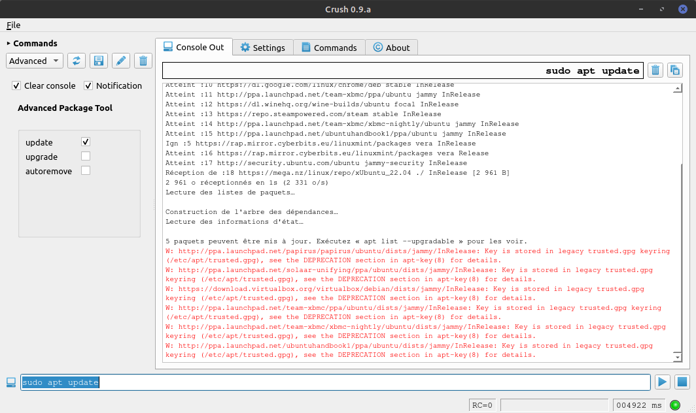

# Crush 
*A friendly program interface for those who don't have one.*

## Summary
- **Crush** aims to provide a graphical interface to command line programs which by definition do not have one. Typically, Crush will build a dynamic graphical interface made up of input fields, checkboxes or drop-down lists from a previously defined XML file specifying all the options of the program to be launched. This eliminates the need to remember all the options and their syntax.
- Command line is dynamically build according to field's inputs.
- Command line is then available for running and its output is displayed into the pseudo-terminal in real time.
- The XML file needed to represent the commands can be edited in the interface, and its content is directly reflected in the list of available commands.

## Built with
- [QtCreator for C++](https://www.qt.io/product/development-tools)
- [Qt5 open source library](https://www.qt.io/download-open-source)
- [Axialis free icons library](http://www.axialis.com/free/icons) by [Axialis Team](http://www.axialis.com)
- [Dmitry Ivanov's XML Syntax Highlighter](https://github.com/d1vanov/basic-xml-syntax-highlighter)

## Authors
- Main developer : [**J.-P. Liguori**](https://github.com/jplozf/Crush)

## License
- This project is licensed under the GNU General Public License.
- See the [LICENSE.md](LICENSE.md) file for details.

## Features
- Available for Windows and Linux systems.
- Convivial user interface with tooltips.
- Pseudo-terminal for running commands and output viewing in real time.
- Notification available upon running completion.
- Customizable GUI colors.

## Requirements
- Qt 5.x libraries

## Screenshots
- About Tab

- Settings Tab

- Commands Tab

- Console Output Tab

## Todo
- Dark theme.
- Running commands into an external terminal.
- XML syntax description.
